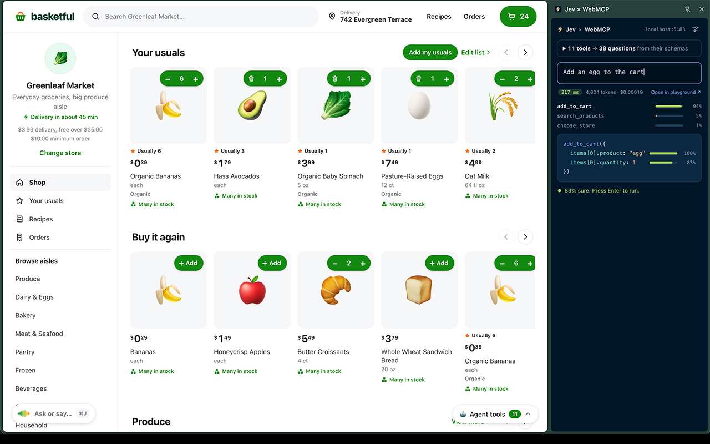

# Jev × WebMCP Chrome 扩展

一个 Chrome 侧边栏扩展：你在输入框里用自然语言说出想要什么，本机 **laya-mlx**（Apple GPU 上的 Laya 决策模型）从当前页面注册的 **WebMCP** 工具里挑出合适的工具，并填好参数。全程本地推理，不需要 TypeSafe API key。侧边栏会随着你的输入实时显示预测的工具调用、每个参数的置信度和延迟。工具选择完全来自页面自己的 schema，不需要为任何站点做专门配置。

```
"got anything gluten free in the bakery aisle?"

search_products({ department: "Bakery", dietary: ["gluten-free"] })     98%   164 ms
```



## Schema 如何转换成问题

WebMCP 暴露的是带描述、参数 schema、枚举和注解的命名工具；Laya 接受 state 和带类型的问题（Choice / Score / Noul），返回带概率的答案。所有问题并行回答，模型不生成文本。

面板把工具 schema 转换成问题的方式：

| schema 里的内容 | 变成 |
| --- | --- |
| 工具列表 | 一个 Choice，选项为 `name -> description`，外加"都不对" |
| `enum`、`const`、`oneOf` 常量 | 对允许值做 Choice |
| `boolean` | Noul |
| 枚举数组 | 每个成员一个 Noul |
| 带小范围 `minimum`..`maximum` 的整数 | 对整个区间做 Choice |
| 自由文本 `string` | 对用户原话的片段（span）做 Choice |
| 其他数字 | 对用户说到的数字做 Choice（代码负责解析） |
| 任何可选字段 | 额外一个"用户提到了吗？"的 Noul，没提到就让工具用默认值 |

## 安装

1. 启动本地推理服务（模型常驻内存，Apple GPU 推理）：

   ```bash
   cd laya-mlx
   cargo build --release
   ./target/release/laya-mlx --serve --port 8400   # 默认 127.0.0.1:8400
   ```

   checkpoint 自动从 `$LAYA_MLX_MODEL_DIR` / `$LAYA_MODEL_DIR` / 本地 Hugging Face 缓存解析。

2. Chrome 149 或更新版本，且 WebMCP 可用（目标站在 origin trial 里，或开启 `chrome://flags/#enable-webmcp-testing`）。
3. 打开 `chrome://extensions` → 开启开发者模式 → **加载已解压的扩展程序** → 选择本目录（`extensions/jev-webmcp`）。
4. 点击扩展的工具栏按钮打开侧边栏。设置里默认已填 `http://127.0.0.1:8400`；如服务不在该地址，改完保存即可（会先探测 `/health`）。
5. 打开一个有 WebMCP 工具的站点，点 **Enable on (site)**。主机权限按站点逐个授予。

没有构建步骤：改完文件，在 `chrome://extensions` 上按重新加载，再打开侧边栏即可。

## 演示流程

打开 Basketful 的线上 demo，或本地跑 shopping cart demo 仓库（`npm run dev`），然后：

1. **工具发现。** 打开面板即可看到发现的工具和从 schema 生成的问题；展开某个工具可以看它的描述和问题数。
2. **边打字边预测。** 输入 `got anything gluten free in the bakery aisle?`，预测的工具、参数和延迟会实时更新。带 `readOnlyHint` 注解的 `search_products` 在置信时可以自动执行。
3. **模糊输入。** 输入 `the cheap one` 查看备选参数预测和置信度变化。
4. **手动选工具。** 点击候选工具即选中并执行。键盘操作：输入末尾按 ↓ 在候选间移动，Enter 运行选中的工具。选择在打字时保持；按 ↑ 回到顶部即回到自动路由。
5. **缺参数。** 输入 `make it three of those instead`。数量能解析出来，但 product 字段识别不了，会留一个输入框给你手动填。
6. **执行与确认。** 输入 `add two oat milks`。会改状态的工具需要按 Enter。结账时 `ok buy it` 会选中 `place_order`，它带 consequential 注解，无论置信度多高都要再按一次 Enter。
7. **没有匹配。** 输入 `tell me a joke` 会看到 "no tool fits"。这类请求应交给单独的 System Two 模型。
8. **在 playground 里检查请求。** 点 "Open in playground" 可以把请求的 state 和问题加载进 TypeSafe playground（仅作调试视图，推理始终在本地）。

## 安全模型

遵循 Chrome 对 WebMCP 的 agent 安全指引：

* **按站点授权。** 面板在你启用某个站点时才请求 `optional_host_permissions`。扩展只访问已启用的站点。
* **执行控制。** 除非工具声明 `readOnlyHint`，否则一律视为会改状态。只有高置信的只读调用能自动执行，且自动执行可以整体关掉。带 consequential / destructive 注解的工具无论置信度多高都需要两次 Enter。点击候选是"选它，执行"：低置信参数、被标记的 manifest、consequential 注解仍然要求二次点击确认。双击的第二下不算确认。
* **Manifest 筛查。** 工具加载时，本地模型会对每个工具描述做一次 Noul：这段文字是在描述工具，还是在跟 agent 说话？被标记的工具会带徽章，且不会自动执行。
* **模型输入边界。** 工具结果只显示在面板里，不进入模型请求。页面提供的工具描述和 schema 是不可信输入，可能影响工具选择或参数；manifest 筛查和执行确认是额外防线。
* **文本渲染。** 工具名、描述和结果全部以文本节点渲染，不使用 HTML。

## 目录结构

```
src/core/        纯 JavaScript，不依赖 chrome.* 和 DOM
  questions.js   工具 + 用户输入 -> Jev 问题与 decode 计划
  spans.js       从用户原话提取候选片段和数字
  decode.js      答案 -> { name, args, confidence, 每参数细节 }
  policy.js      auto / ready / confirm / incomplete / none
  screen.js      manifest 筛查
src/jev.js       本地 laya-mlx 服务（/v1/systemone、/health）的 fetch 客户端
src/platform/    chrome.js（真实：scripting / permissions / storage）与 mock.js（harness）
src/panel/       侧边栏
evals/run.js     用本地 laya-mlx + Basketful manifest 评测准确率与延迟
```

页面桥接（`src/platform/chrome.js` 里的 `pageListTools` / `pageCallTool`）通过 `chrome.scripting` 注入页面主世界运行。它处理了两个 API 细节：Chrome 返回的 `inputSchema` 是 JSON **字符串**，而 `executeTool` 需要传入 `RegisteredTool` 对象本身和 JSON 字符串形式的参数。

## 开发

```bash
npm test          # 核心逻辑：schema -> 问题、答案 -> 调用、策略（无网络）
npm run harness   # 把面板当普通网页跑在 fixtures 上，带打标的 mock 模型
npm run eval      # 本地 laya-mlx + Basketful manifest：准确率与延迟（先 `laya-mlx --serve`；可用 LAYA_MLX_URL 覆盖地址）
```

## 已知限制

* 数组参数（包括 `items: [...]`）目前只填第一个元素。
* 面向本地模型的适配（均已实测）：路由 criteria 只放工具名（长描述会把用户原话挤出模型 512 token 窗口，路由塌成 none，且延迟翻倍）；"none" 描述用短句；state 用纯自然语言字符串；祈使动词和数词不作 span 候选。当前 Basketful 评测 7/17、中位 2.1s/次。
* 剩余失败集中在搜索/菜谱等疑问句式与多词产品名（如 "oat milk" 被选成 "oat"，面板会显示 runner-up），这是该 laya-rl-agent checkpoint 在此任务上的能力边界；继续提升需要调整问题设计或换模型。
* 打字时每个停顿触发一次完整推理（Basketful 这类大 schema 约 2–3 秒）；被中止的请求会在服务器端取消，不再排队堆积。

## 致谢与许可

本扩展基于 [sdras/jev-webmcp-extension](https://github.com/sdras/jev-webmcp-extension)（Apache License 2.0）实现，保持其架构与行为，并把推理后端从 TypeSafe 云端 API 替换为本仓库的 `laya-mlx` 本地服务。见本目录下的 `LICENSE`。

第三方 `vendor/lz-string.min.js` 保持其自身的 MIT 许可（`vendor/lz-string.LICENSE`）。
